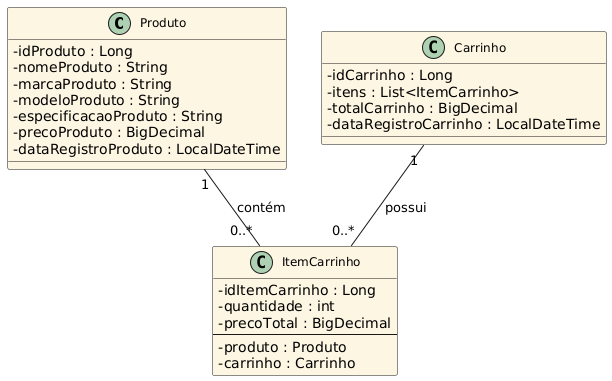

# Anotações relacionadas ao projeto Spring

---

# Fluxo - UML

#### **Carrinho (1) -------- (N) ItemCarrinho (N) -------- (1) Produto**

     Um Carrinho pode ter vários Itens (1 para muitos).

     Cada ItemCarrinho está ligado a exatamente um Produto (muitos para 1).




# Classe Modelo - Produto

```java
@Data
@Entity
@NoArgsConstructor
@AllArgsConstructor
@Builder
@Table(name = "produtos")
public class Produto {
  // atributos...
}

```

🔹 @Data (do Lombok)
- Gera automaticamente:

- getters e setters

- toString()

- equals() e hashCode()

🔸 Objetivo: evitar código repetitivo (boilerplate) e manter a classe limpa e legível.

🔹 @Entity (do JPA)
- Indica que essa classe representa uma entidade do banco de dados.

- Cada instância será um registro (linha) na tabela correspondente.

🔹 @Table(name = "produtos")
- Define o nome da tabela no banco como produtos.

- Sem essa anotação, o nome da tabela seria produto por padrão (nome da classe).

🔹 @NoArgsConstructor (do Lombok)
- Gera automaticamente um construtor sem argumentos.

- Necessário para o JPA criar instâncias da entidade via reflexão.

🔹 @AllArgsConstructor (do Lombok)
- Gera automaticamente um construtor com todos os atributos como parâmetros.

🔹 @Builder (do Lombok)
- Permite criar objetos da classe usando o padrão de projeto Builder:

```java
Produto produto = Produto.builder()
.nomeProduto("Monitor LG")
.marcaProduto("LG")
.modeloProduto("UltraWide")
.precoProduto(new BigDecimal("1999.90"))
.build();
```

### Chave Primária
    
```java
@Id
@GeneratedValue(strategy = GenerationType.IDENTITY)
private long idProduto;
```

- @Id: Define que o campo é a chave primária.

- @GeneratedValue(strategy = GenerationType.IDENTITY):
O valor do ID será gerado automaticamente pelo banco de dados (auto-incremento).

### Campos Obrigatórios

```java
@Column(nullable = false)
private String nomeProduto;
```

- @Column(nullable = false): Campo obrigatório no banco de dados.

### Especificações do Produto

```java
@Column(nullable = false, length = 300)
private String especificacaoProduto;
```

- Obrigatório e com limite de até 300 caracteres.

### Preço do Produto

```java
@Column(nullable = false)
private BigDecimal precoProduto;
```

- Valor obrigatório e representado com BigDecimal para precisão financeira.

### Data de Registro do Produto

```java
@CreationTimestamp
@JsonFormat(pattern = "dd/MM/yyyy HH:mm:ss")
@Column(nullable = false, updatable = false)
private LocalDateTime dataRegistroProduto;
```

- @CreationTimestamp: O valor será preenchido automaticamente com a data e hora da criação do registro (Hibernate).

- @JsonFormat(...): Define o formato da data ao converter para JSON (ex: "19/05/2025 14:23:00"). 

- @Column(nullable = false, updatable = false):

  - Campo obrigatório no banco (nullable = false).

  - Não pode ser alterado depois de criado (updatable = false).

---

# Classe DTO - ProdutoDTO

### Finalidade

- A classe ProdutoDTO é usada para transferência de dados entre a aplicação e os consumidores da API (como controladores REST), separando a entidade Produto do que é exposto ou recebido externamente.

### Anotações

🔹 @Data (Lombok)
- Gera automaticamente getters, setters, toString(), equals() e hashCode().

🔹 @Builder (do Lombok)
- Permite criar objetos da classe usando o padrão de projeto Builder:

### Validações

@NotBlank
- Garante que o valor não seja nulo, vazio ou apenas espaços em branco.

- Utilizado nos campos de texto (nomeProduto, marcaProduto, modeloProduto, especificacaoProduto).

@Size(max = 300)
- Limita o tamanho máximo da string especificacaoProduto a 300 caracteres.

@NotNull
- Garante que o campo precoProduto não seja nulo.

@Positive
- Garante que o preço seja maior que zero, evitando valores negativos ou zerados.

---

# Classe Service - ProdutoService

```java
@Service
public class ProdutoService {
    
    @Autowired
    private ProdutoRepository produtoRepository;
    
    // métodos...
}
```

🔹 @Service (Spring)

- Indica que a classe é um serviço, um componente da camada de negócio da aplicação.

- Permite que o Spring faça a injeção automática dessa classe onde for necessário.

🔹 @Autowired

- Injeta automaticamente o bean ProdutoRepository criado pelo Spring Data JPA para acessar o banco de dados.

- Permite usar o repositório para operações CRUD no banco.

### Conversão entre DTO e Entidade

- A classe ProdutoService utiliza dois métodos auxiliares privados para realizar a conversão entre ProdutoDTO (usado na comunicação com a API) e a entidade Produto (persistida no banco de dados):

```java
private Produto paraEntity(ProdutoDTO produtoDTO) {
    return Produto.builder()
          .idProduto(produtoDTO.getIdProduto())
          .nomeProduto(produtoDTO.getNomeProduto())
          .marcaProduto(produtoDTO.getMarcaProduto())
          .modeloProduto(produtoDTO.getModeloProduto())
          .especificacaoProduto(produtoDTO.getEspecificacaoProduto())
          .precoProduto(produtoDTO.getPrecoProduto())
          .build();
}
```
- Converter um objeto ProdutoDTO em uma entidade Produto.
- Transforma os dados recebidos da API (ProdutoDTO) em um objeto pronto para persistência com o builder. <br> </br> <br>

```java
private ProdutoDTO paraDTO(Produto produto) {
    return ProdutoDTO.builder()
          .idProduto(produto.getIdProduto())
          .nomeProduto(produto.getNomeProduto())
          .marcaProduto(produto.getMarcaProduto())
          .modeloProduto(produto.getModeloProduto())
          .especificacaoProduto(produto.getEspecificacaoProduto())
          .precoProduto(produto.getPrecoProduto())
          .build();
}
```
- Converter uma entidade Produto em um objeto ProdutoDTO.
- Transforma os dados persistidos da entidade em um DTO para ser exposto via API.

### Cadastrar Produto

```java
public ProdutoDTO cadastrarProduto(ProdutoDTO produtoDTO) {
    Produto produto = paraEntity(produtoDTO);
    Produto produtoSalvo = produtoRepository.save(produto);
    return paraDTO(produtoSalvo);
}
```

- Converte o DTO em entidade e salva no banco de dados.

- Retorna o produto salvo convertido novamente em DTO.

### Listar todos os produtos

```java
public List<ProdutoDTO> listarTodosProdutos() {
    List<Produto> produtos = produtoRepository.findAll();
    List<ProdutoDTO> produtoDTOs = new ArrayList<>();
    
    for (Produto produto : produtos) {
        produtoDTOs.add(paraDTO(produto));
    }
    
    return produtoDTOs;
}
```

- Busca todos os produtos no banco de dados.

- Converte cada produto da lista para DTO.

- Retorna a lista de DTOs.

### Deletar produto por ID

```java
public void deletarProdutoPorId(Long id) {
    Optional<Produto> optionalProduto = produtoRepository.findById(id);
    if (optionalProduto.isEmpty()) {
        throw new ProdutoException(id);
    }
    
    produtoRepository.deleteById(id);
}
```

- Verifica se o produto existe no banco pelo ID.

- Se não existir, lança uma exceção personalizada ProdutoException.

- Caso exista, deleta o produto.

### Buscar produto por ID

```java
public ProdutoDTO buscarProdutoPorId(Long id) {
    Optional<Produto> optionalProduto = produtoRepository.findById(id);
    if (optionalProduto.isEmpty()) {
        throw new ProdutoException(id);
    }
    
    return paraDTO(optionalProduto.get());
}
```

- Verifica se o produto existe pelo ID.

- Se não existir, lança ProdutoException.

- Se existir, converte e retorna o produto em forma de DTO.

### Atualizar produto por ID

```java
public ProdutoDTO atualizarProdutoPorId(Long id, ProdutoDTO produtoDTO) {
    Optional<Produto> optionalProduto = produtoRepository.findById(id);
    if (optionalProduto.isEmpty()) {
        throw new ProdutoException(id);
    }
    
    Produto produto = optionalProduto.get();
    produto.setNomeProduto(produtoDTO.getNomeProduto());
    produto.setMarcaProduto(produtoDTO.getMarcaProduto());
    produto.setModeloProduto(produtoDTO.getModeloProduto());
    produto.setEspecificacaoProduto(produtoDTO.getEspecificacaoProduto());
    produto.setPrecoProduto(produtoDTO.getPrecoProduto());
    Produto produtoSalvo = produtoRepository.save(produto);
    
    return paraDTO(produtoSalvo);
}
```

- Verifica se o produto existe pelo ID.

- Se não existir, lança ProdutoException.

- Se existir: 

  - Atualiza os dados do produto com base no DTO recebido.

  - Salva a alteração no banco. 

  - Retorna o produto atualizado como DTO.

---

# Classe de Exceção - ProdutoException

```java
public class ProdutoException extends RuntimeException {
    public ProdutoException(Long id) {
        super("Produto com ID " + id + " não encontrado.");
    }
}
```

🔹 Extensão de RuntimeException

- A classe herda de RuntimeException, que é uma exceção não verificada (unchecked).

- Não é obrigatório tratar ou declarar essa exceção nos métodos, simplificando o código.

- Ideal para situações em que a falha indica erro de lógica, como tentar acessar um produto inexistente.

🔹 Construtor personalizado

- Recebe o id do produto que causou a exceção.

- Passa uma mensagem personalizada para a superclasse com o texto:
"Produto com ID " + id + " não encontrado."

- Isso facilita o entendimento do erro ao ser lançado e exibido no log ou para o usuário.

---

# Classe Controller - ProdutoController

```java
@RestController // marca como controller REST
@RequestMapping("/produtos") // define o prefixo da rota
public class ProdutoController {
    
}
```

### Finalidade
- A classe ProdutoController é responsável por expor os endpoints da API REST relacionados ao recurso Produto, atuando como a camada de controle entre o cliente (frontend ou outro serviço) e a lógica de negócio contida no ProdutoService.

🔹 Anotações Usadas
- @RestController:
- Indica que essa classe é um controller REST, e que os métodos anotados retornarão diretamente os dados no corpo da resposta (sem necessidade de @ResponseBody em cada método). <br> <br>

- @RequestMapping("/produtos"):
- Define o caminho base de todos os endpoints da classe como /produtos.

🔹 Injeção de Dependência

```java
@Autowired
private ProdutoService produtoService;
```

- O ProdutoService é injetado automaticamente pelo Spring para que o controller possa delegar a lógica de negócio ao service.

### Métodos e Endpoints

🔹 **POST /produtos — Criar Produto**

```java
@PostMapping
public ResponseEntity<ProdutoDTO> criarProdutos(@Valid @RequestBody ProdutoDTO produtoDTO) {
    ProdutoDTO produtoCadastrado = produtoService.cadastrarProduto(produtoDTO);
    return ResponseEntity.status(HttpStatus.CREATED).body(produtoCadastrado);
}
```

- Recebe os dados do produto via JSON.

- Valida os dados com @Valid.

- Retorna status 201 Created com o produto criado no corpo da resposta. <br> <br>

- ResponseEntity.status(HttpStatus.CREATED)
  - Cria um builder para uma resposta HTTP com status 201 Created. <br> <br>

- .body(produtoCadastrado)
  - Define que o corpo da resposta será o objeto produtoCadastrado (serializado como JSON automaticamente pelo Spring, pois é um @RestController). <br> <br>

🔹 **GET /produtos — Listar Todos os Produtos**

```java
@GetMapping
public ResponseEntity<List<ProdutoDTO>> listarProdutos() {
    return ResponseEntity.ok(produtoService.listarTodosProdutos());
}
```

- Retorna todos os produtos cadastrados.

- Usa ResponseEntity.ok(...) para retornar status 200 OK.

- O corpo da resposta contém uma lista de produtos em formato JSON. <br> <br>

🔹 **GET /produtos/{id} — Buscar Produto por ID**

```java
@GetMapping("/{id}")
public ResponseEntity<ProdutoDTO> buscarPorId(@PathVariable Long id) {
    return ResponseEntity.ok(produtoService.buscarProdutoPorId(id));
}
```

- Extrai o id do produto da URL com @PathVariable.

- Busca o produto correspondente no banco de dados.

- Retorna:

  - 200 OK se o produto for encontrado.

  - Uma exceção (como ProdutoException) pode ser lançada se não encontrado.

- O corpo da resposta contém o produto encontrado, convertido em JSON. <br> <br>

🔹 **PUT /produtos/{id} — Atualizar Produto por ID**

```java
@PutMapping("/{id}")
public ResponseEntity<ProdutoDTO> atualizarProduto(@PathVariable Long id, @Valid @RequestBody ProdutoDTO produtoDTO) {
    return ResponseEntity.ok(produtoService.atualizarProdutoPorId(id, produtoDTO));
}
```

- Recebe o id pela URL e os novos dados do produto no corpo (JSON).

- Valida os dados com @Valid.

- Atualiza o produto existente com os novos dados.

- Retorna 200 OK com o produto atualizado no corpo da resposta. <br> <br>

🔹 **DELETE /produtos/{id} — Deletar Produto por ID**

```java
@DeleteMapping("/{id}")
public ResponseEntity<Void> deletarProduto(@PathVariable Long id) {
    produtoService.deletarProdutoPorId(id);
    return ResponseEntity.noContent().build();
}
```

- Extrai o id do produto da URL.

- Remove o produto correspondente do banco de dados.

- Retorna 204 No Content, indicando sucesso, mas sem corpo na resposta.

## Códigos de Status HTTP Comuns em REST APIs

| Código | Nome                  | Quando usar                                                        |
|--------|-----------------------|-------------------------------------------------------------------|
| 200    | OK                    | Requisição bem-sucedida. Usado para GET, PUT, ou DELETE com corpo de resposta. |
| 201    | Created               | Recurso criado com sucesso. Usado em POST quando um novo recurso é criado. |
| 204    | No Content            | Requisição bem-sucedida, mas sem conteúdo na resposta. Comum em DELETE ou PUT. |
| 400    | Bad Request           | Requisição malformada ou com dados inválidos. Pode ocorrer por erro de validação. |
| 401    | Unauthorized          | O cliente não está autenticado. Usuário precisa fazer login/autenticação. |
| 403    | Forbidden             | Cliente autenticado, mas não tem permissão para acessar o recurso. |
| 404    | Not Found             | Recurso não encontrado. Exemplo: produto com ID inexistente.      |
| 409    | Conflict              | Conflito ao tentar criar/atualizar um recurso. Ex: nome duplicado.|
| 500    | Internal Server Error | Erro inesperado no servidor. Pode ser exceção não tratada.        |

### Como seu controller se comporta com esses códigos:

- `@GetMapping`, `@PutMapping`, `@DeleteMapping` → retornam **200 OK** ou **204 No Content**.

- `@PostMapping` → retorna **201 Created**.

- Exceções como `ProdutoException` → você pode configurar para que retornem **404 Not Found** com uma `@ControllerAdvice`.

- Erros de validação com `@Valid` → retornam **400 Bad Request** automaticamente pelo Spring Boot.

---

# Classe Modelo - Carrinho

```java
@Data
@Entity
@NoArgsConstructor
@AllArgsConstructor
@Builder
@Table(name = "carrinhos")
public class Carrinho {
    
}
```

🔹 @Data (do Lombok)

- Gera automaticamente:

- getters e setters

- toString()

- equals() e hashCode()

🔸 Objetivo: evitar código repetitivo e manter a classe limpa.

🔹 @Entity (do JPA)

- Indica que essa classe representa uma entidade do banco de dados.

- Cada instância da classe representa um carrinho no banco.

🔹 @Table(name = "carrinhos")

- Define o nome da tabela no banco como carrinhos.

- Se omitido, o nome padrão seria carrinho.

🔹 @NoArgsConstructor / @AllArgsConstructor

- Construtores padrão (sem e com todos os campos) necessários para instanciar a classe via JPA e para testes.

🔹 @Builder

- Permite criar objetos de forma fluente com o padrão de projeto Builder.

### Chave Primária

```java
@Id
@GeneratedValue(strategy = GenerationType.IDENTITY)
private Long idCarrinho;
```

- @Id: Define o campo como chave primária.

- @GeneratedValue(...): O valor é gerado automaticamente pelo banco (auto-incremento).

### Lista de Itens no Carrinho

```java
@OneToMany(mappedBy = "carrinho", cascade = CascadeType.ALL, orphanRemoval = true, fetch = FetchType.LAZY)
private List<ItemCarrinho> itens = new ArrayList<>();
```

- Representa a relação 1:N entre Carrinho e ItemCarrinho.

- mappedBy = "carrinho": a associação é controlada pela entidade ItemCarrinho.

- cascade = ALL: se o carrinho for salvo/removido, os itens também serão.

- orphanRemoval = true: se um item for removido da lista, será deletado do banco.

- fetch = LAZY: os itens só são carregados quando acessados (melhora o desempenho).

### Total do Carrinho

```java
@Column(nullable = false)
private BigDecimal totalCarrinho = BigDecimal.ZERO;
```

- Valor total acumulado dos itens do carrinho.

- Tipo BigDecimal para operações precisas com dinheiro.

### Data de Registro

```java
@CreationTimestamp
@Column(nullable = false, updatable = false)
private LocalDateTime dataRegistroCarrinho;
```

- @CreationTimestamp: preenche automaticamente com a data/hora da criação.

- updatable = false: não permite que a data seja alterada após o registro.

---

# Classe Modelo - ItemCarrinho

```java
@Data
@Entity
@NoArgsConstructor
@AllArgsConstructor
@Builder
@Table(name = "itens_carrinho")
public class ItemCarrinho {
    
}
```

🔹 @Data, @Entity, @Table, @NoArgsConstructor, @AllArgsConstructor, @Builder

- Mesma funcionalidade descrita na classe anterior.

### Chave Primária

```java
@Id
@GeneratedValue(strategy = GenerationType.IDENTITY)
private Long idItemCarrinho;
```

- Identificador único de cada item. 

### Produto Relacionado

```java
@ManyToOne
@JoinColumn(nullable = false)
private Produto produto;
```

- Muitos itens podem estar relacionados a um mesmo produto.

- nullable = false: obrigatório definir o produto do item.

### Carrinho ao qual o Item Pertence

```java
@ManyToOne
@JoinColumn(nullable = false)
private Carrinho carrinho;
```

- Muitos itens pertencem a um único carrinho.

- Define a relação N:1 com Carrinho.

### Quantidade do Produto

```java
@Column(nullable = false)
private int quantidade;
```

- Quantidade do produto incluído no carrinho.

### Preço Total do Item

```java
@Column(nullable = false)
private BigDecimal precoTotal;
```

- Preço total deste item no carrinho (ex: precoProduto * quantidade).

- Usado para somar no totalCarrinho.